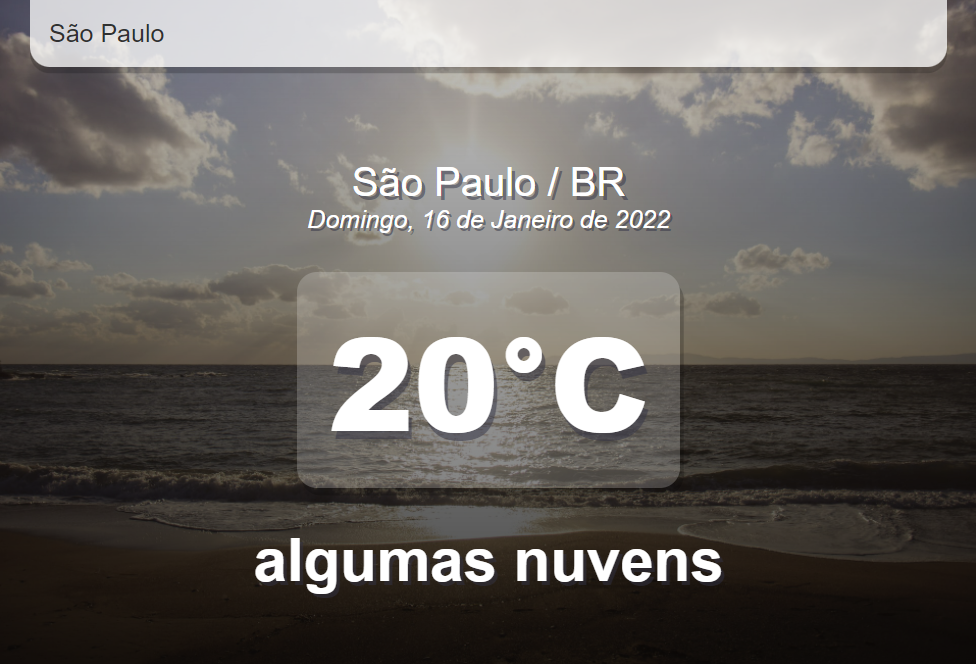
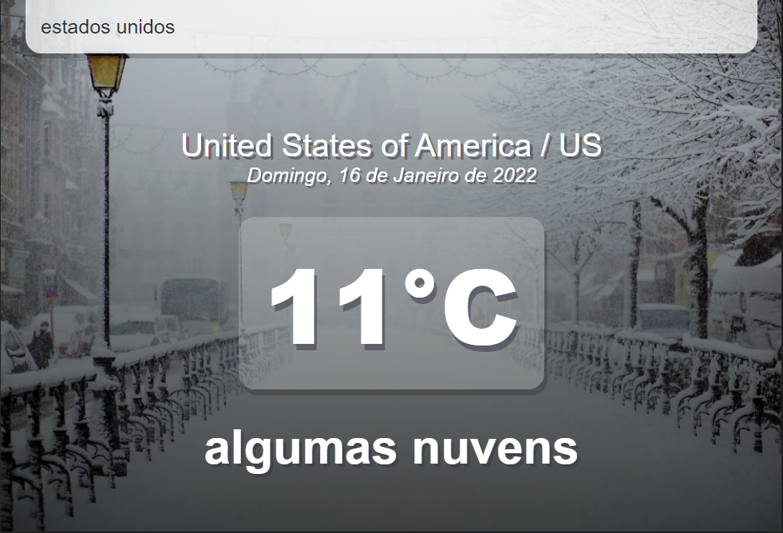

Para usar o aplicativo de informações de tempo, é necessário:
- Criar um login no site https://openweathermap.org/api 
- Criar uma key para a API *Current Weather Data*. 
- Colocar essa chave no arquivo App.js (o qual se encontra dentro da pasta src). A key dever adicionada no arquivo, dentro da const api, no local indicado com SUA CHAVE, mantendo as aspas.
- A biblioteca React é necessária para essa aplicação, caso não a tenha, por favor, instale-a.
- Iniciar o servidor com yarn start ou o npm start, caso não tenha o yarn ou npm instalado, por favor instale um deles para usá-los.

Já com a aplicação funcionando, escreva na barra superior o nome do local o qual você deseja saber a temperatura no momento atual, e clique enter. Se existir esse local no servidor, a sua temperatura será apresentada a você.

Exemplos da aplicação:

    
